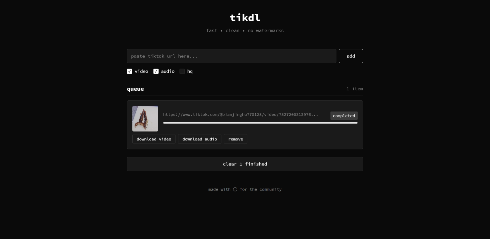

# tikdl


A clean, fast, and self-hostable TikTok downloader. No watermarks.

tikdl provides a simple web interface to download TikTok videos and their corresponding audio tracks. It's built with a Go backend and a lightweight vanilla JS frontend, using WebSockets for real-time communication.



## ✨ Features

*   **Clean & Minimalist UI:** A simple, dark-mode interface that is easy to use.
*   **No Watermarks:** Downloads the original video file provided by the TikTok API.
*   **Download Video & Audio:** Get links for both the full video and the separate audio track.
*   **Real-time Queue System:** Add multiple links to the queue and watch their status update live.
*   **Asynchronous Processing:** The Go backend uses a worker pool to process downloads without blocking the UI.
*   **Entirely Self-Hostable:** No external dependencies or APIs needed. Run it on your own server.
*   **Live Previews:** The queue displays a muted, looping video preview once the link is processed.

## 🛠️ Tech Stack

*   **Backend:** Go
*   **Real-time Communication:** WebSockets
*   **Frontend:** Vanilla HTML5, CSS3, and JavaScript (no frameworks)

## 🚀 Getting Started

You can run `tikdl` on your local machine or any server with Go installed.

### Prerequisites

*   [Go](https://go.dev/doc/install) version 1.18 or higher.

### Installation & Running

1.  **Clone the repository:**
    ```sh
    git clone https://github.com/lrdcxdes/tikdl.git
    cd tikdl
    ```

2.  **Tidy dependencies:**
    This will download the necessary Go modules (like `gorilla/websocket`).
    ```sh
    go mod tidy
    ```

3.  **Run the server:**
    ```sh
    go run main.go
    ```
    You should see a confirmation message in your terminal:
    ```
    Started 4 workers
    Server started on :8080
    ```

4.  **Open the web interface:**
    Navigate to `http://localhost:8080` in your web browser.

## ⚙️ How It Works

The application has a simple but effective architecture:

1.  The frontend establishes a persistent WebSocket connection to the Go server.
2.  When a user submits a TikTok URL, a JSON message is sent to the server over the WebSocket.
3.  The Go backend receives the message and creates a `DownloadJob`, which is pushed into a buffered channel (the job queue).
4.  A pool of background `worker` goroutines listens on this channel. One of the workers picks up the job.
5.  The worker uses the `ext/tiktok` module to fetch the video details (description, direct download links for video/audio).
6.  Once processing is complete, the worker sends a result message (containing the direct links or an error) back to the specific client over its WebSocket connection.
7.  The frontend JavaScript receives the message and dynamically updates the UI to show the result, including the video preview and download buttons.

## 🤝 Contributing

Contributions are welcome! If you have a feature request, find a bug, or want to improve the code, please feel free to:

1.  Open an [Issue](https://github.com/lrdcxdes/tikdl/issues) to discuss the change.
2.  Fork the repository and create a new branch.
3.  Make your changes.
4.  Submit a Pull Request.

## 📜 License

This project is licensed under the **MIT License**. See the [LICENSE](LICENSE) file for details.

## ⚠️ Disclaimer

This tool is intended for personal and educational purposes only. Please respect the intellectual property rights of content creators. Users are responsible for ensuring they comply with TikTok's terms of service and all applicable copyright laws. The developers of this project assume no responsibility for any misuse of this tool.```